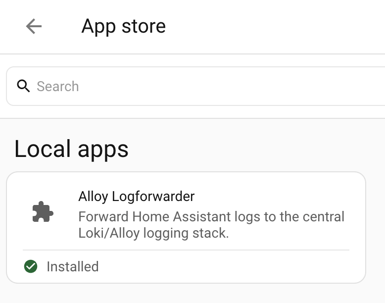

# Alloy Logforwarder

Alloy Logforwarder sends selected Home Assistant logs to a Grafana Loki
endpoint. It is intended for Home Assistant OS installations where logs are
normally visible inside Home Assistant, but you also want to search, filter and
alert on them in Grafana.

This add-on has only been tested with Home Assistant OS.

## What It Does

The add-on can collect logs from:

- Home Assistant Core
- Supervisor
- Host
- DNS
- Audio
- Multicast
- other Home Assistant add-ons, such as Mosquitto and Zigbee2MQTT

It forwards those logs to Loki with consistent labels such as `host`, `site`,
`service`, `app`, `source_type`, `environment`, `stream` and `severity`.

It does not install Loki or Grafana. You need an existing Loki endpoint and a
Grafana instance that can read from it.

## Before You Start

You need:

- a running Home Assistant OS instance;
- network access from Home Assistant to your Loki endpoint;
- the Loki push URL, for example `http://loki.example.local:3100/loki/api/v1/push`;
- the Home Assistant add-ons or system log sources you want to forward.

Optional but recommended:

- a Grafana dashboard or Explore view ready for checking incoming logs;
- a short list of labels you want to use for this Home Assistant instance.

## Example Loki And Grafana Stack

Alloy Logforwarder does not install Loki or Grafana. It only sends logs to an
existing Loki push endpoint. A valid target can be a small Docker Compose stack
with Loki, Grafana and optionally Grafana Alloy.

The Borobudur homelab stack is an example of such a setup:

```yaml
services:
  loki-logging-loki:
    image: grafana/loki:3.0.0
    container_name: loki-logging-loki
    user: "0:0"
    restart: unless-stopped
    command: -config.file=/etc/loki/local-config.yaml
    ports:
      - "3100:3100"
    volumes:
      - ./data/loki:/loki
    networks:
      - loki-logging

  loki-logging-grafana:
    image: grafana/grafana:11.1.0
    container_name: loki-logging-grafana
    user: "0:0"
    restart: unless-stopped
    depends_on:
      - loki-logging-loki
    ports:
      - "3300:3000"
    environment:
      GF_SECURITY_ADMIN_USER: admin
      GF_SECURITY_ADMIN_PASSWORD: admin
      GF_USERS_ALLOW_SIGN_UP: "false"
    volumes:
      - ./data/grafana:/var/lib/grafana
      - ./provisioning/datasources:/etc/grafana/provisioning/datasources:ro
    networks:
      - loki-logging

  loki-logging-alloy:
    image: grafana/alloy:v1.3.1
    container_name: loki-logging-alloy
    restart: unless-stopped
    depends_on:
      - loki-logging-loki
    command:
      - run
      - /etc/alloy/config.alloy
      - --storage.path=/var/lib/alloy/data
      - --server.http.listen-addr=0.0.0.0:12345
    ports:
      - "3315:12345"
    volumes:
      - /var/run/docker.sock:/var/run/docker.sock:ro
      - ./config/config.alloy:/etc/alloy/config.alloy:ro
      - ./data/alloy:/var/lib/alloy/data
    networks:
      - loki-logging

networks:
  loki-logging:
    name: loki-logging
```

For the rest of this documentation, assume the Loki push endpoint is:

```text
http://loki.example.local:3100/loki/api/v1/push
```

In a real environment this hostname can point to the server running the example
stack. For the Borobudur example above, expose or proxy Loki so that this URL
resolves to the Loki service.

Grafana can be exposed separately, for example:

```text
http://grafana.example.local
```

The Grafana data source should point to Loki from inside the Docker network:

```text
http://loki-logging-loki:3100
```

For another environment, change hostnames, ports, credentials and persistence
paths to match your server. Do not keep the example `admin`/`admin` Grafana
credentials in a shared or production environment.

Related documentation:

- [Install Loki with Docker or Docker Compose](https://grafana.com/docs/loki/latest/setup/install/docker/)
- [Run Grafana Docker image](https://grafana.com/docs/grafana/latest/setup-grafana/installation/docker/)
- [Configure the Loki data source](https://grafana.com/docs/grafana/latest/datasources/loki/)
- [Run Grafana Alloy in a Docker container](https://grafana.com/docs/alloy/latest/set-up/install/docker/)

## Install

Install Alloy Logforwarder as a custom Home Assistant app/add-on repository.
Use the HTTPS GitHub repository URL:

```text
https://github.com/eiri020/alloy-logforwarder
```

Do not use the SSH Git URL (`git@github.com:eiri020/alloy-logforwarder.git`)
inside Home Assistant. The add-on store expects a repository URL that Home
Assistant can fetch without your local SSH keys.

1. Open Home Assistant.
2. Go to **Settings**.
3. Open **Add-ons**.
4. Open the add-on store.
5. Open the three-dot menu in the top-right corner.
6. Choose **Repositories**.
7. Paste the repository URL:

   ```text
   https://github.com/eiri020/alloy-logforwarder
   ```

8. Select **Add**.
9. Close the repository dialog.
10. Refresh the add-on store if Alloy Logforwarder does not appear
    immediately.
11. Open **Alloy Logforwarder**.
12. Select **Install**.



## Basic Configuration

At minimum, configure `loki_url` and the instance labels.

Example:

```yaml
loki_url: http://loki.example.local:3100/loki/api/v1/push
log_level: info
host_label: homeassistant
site_label: home
environment_label: prod
```


Image to add: take a screenshot of the add-on **Configuration** tab showing the
Loki URL and the main labels. Hide or crop anything sensitive.

## Enable Log Sources

Log sources are configured under `supervisor_log_sources`. A source is active
when `enabled` is set to `true`.

Example for Home Assistant Core:

```yaml
supervisor_log_sources:
  - enabled: true
    name: homeassistant_core
    slug: core
    endpoint: core/logs
    path: /tmp/alloy-logforwarder/homeassistant-core.log
    snippet: /etc/alloy-logforwarder/snippets/homeassistant-core.alloy
    service: homeassistant
    app: homeassistant
    source_type: ha-core
    stream: events
    poll_interval: 30
```

Example for Mosquitto:

```yaml
supervisor_log_sources:
  - enabled: true
    name: mosquitto
    slug: core_mosquitto
    endpoint: addons/core_mosquitto/logs
    path: /tmp/alloy-logforwarder/addons/core_mosquitto.log
    snippet: /etc/alloy-logforwarder/snippets/mosquitto.alloy
    service: mosquitto
    app: mosquitto
    source_type: mosquitto
    stream: events
    poll_interval: 30
```

Example for Zigbee2MQTT:

```yaml
supervisor_log_sources:
  - enabled: true
    name: zigbee2mqtt
    slug: 45df7312_zigbee2mqtt
    endpoint: addons/45df7312_zigbee2mqtt/logs
    path: /tmp/alloy-logforwarder/addons/45df7312_zigbee2mqtt.log
    snippet: /etc/alloy-logforwarder/snippets/zigbee2mqtt.alloy
    service: zigbee2mqtt
    app: zigbee2mqtt
    source_type: zigbee2mqtt
    stream: events
    poll_interval: 30
```


Image to add: take a screenshot of the add-on **Configuration** tab with at
least Home Assistant Core and one add-on source enabled.

## Included Source Types

| Source | Default endpoint | Default snippet |
|---|---|---|
| Home Assistant Core | `core/logs` | `homeassistant-core.alloy` |
| Supervisor | `supervisor/logs` | `supervisor-generic.alloy` |
| Host | `host/logs` | `supervisor-generic.alloy` |
| DNS | `dns/logs` | `supervisor-generic.alloy` |
| Audio | `audio/logs` | `supervisor-generic.alloy` |
| Multicast | `multicast/logs` | `supervisor-generic.alloy` |
| Mosquitto | `addons/core_mosquitto/logs` | `mosquitto.alloy` |
| Zigbee2MQTT | `addons/45df7312_zigbee2mqtt/logs` | `zigbee2mqtt.alloy` |
| Alloy Logforwarder | `addons/local_alloy_logforwarder/logs` | `supervisor-generic.alloy` |

The exact add-on slug can differ when you use a different add-on repository.
Check the add-on URL or Home Assistant add-on information page when in doubt.

## Add A Custom Add-on Source

For another Home Assistant add-on, add a new item to `supervisor_log_sources`.
Use the add-on slug in the endpoint:

```yaml
supervisor_log_sources:
  - enabled: true
    name: my_addon
    slug: my_addon_slug
    endpoint: addons/my_addon_slug/logs
    path: /tmp/alloy-logforwarder/addons/my_addon_slug.log
    snippet: /config/alloy-logforwarder/my-addon.alloy
    service: my-addon
    app: my-addon
    source_type: my-addon
    stream: events
    poll_interval: 30
```

Place the custom Alloy snippet in:

```text
/config/alloy-logforwarder/my-addon.alloy
```

The snippet controls parsing, filtering and label mapping for that source.


Image to add: take a screenshot of the custom `.alloy` file in your Home
Assistant file editor.

## Start And Check

1. Save the configuration.
2. Start or restart Alloy Logforwarder.
3. Open the add-on **Log** tab.
4. Check for startup messages and source collector messages.

Healthy startup should show that the app generated an Alloy config and started
collectors for the enabled sources.


Image to add: take a screenshot of the add-on **Log** tab after a successful
start. Include the lines that show enabled collectors.

## Verify In Grafana

Open Grafana Explore and query Loki.

Useful queries:

```logql
{host="homeassistant"}
```

```logql
{host="homeassistant", source_type="ha-core"}
```

```logql
{host="homeassistant", source_type="zigbee2mqtt"}
```

```logql
{host="homeassistant", source_type="mosquitto"}
```

Replace `homeassistant` with your configured `host_label`.


Image to add: take a screenshot of Grafana Explore showing logs from at least
one Home Assistant source. Include the label browser or visible labels if
possible.


Image to add: take a screenshot of a dashboard panel or table that shows log
volume, recent errors or recent Home Assistant log lines.

## Troubleshooting

### The add-on starts, but no logs appear in Grafana

Check:

- `loki_url` points to `/loki/api/v1/push`;
- Home Assistant can reach the Loki host and port;
- at least one `supervisor_log_sources` item has `enabled: true`;
- the add-on log does not show Loki push errors;
- your Grafana query uses the configured `host_label` and `source_type`.

### A source is empty

Some sources only emit logs when something happens. For example, Zigbee2MQTT
may be quiet except for device events or update messages. Wait for new source
activity or restart the source add-on to generate fresh log lines.

### Zigbee2MQTT publish noise is missing

The included Zigbee2MQTT snippet intentionally filters noisy MQTT publish
messages. This keeps Loki smaller and makes incidents easier to search. Use a
custom snippet if you want to keep those messages.

### The add-on cannot read logs

This add-on depends on the Home Assistant Supervisor API. Confirm that it is
running on Home Assistant OS or another supervised installation and that the
add-on has been granted Supervisor API access.

## Image Checklist

Add these images before publishing broader end-user documentation:

| File | Screenshot to make |
|---|---|
| `docs/images/addon-store-custom-repository.png` | Add-on store repository dialog with the custom repository URL |
| `docs/images/addon-store-alloy-logforwarder.png` | Add-on store with Alloy Logforwarder visible |
| `docs/images/config-basic-labels.png` | Configuration tab with Loki URL and labels |
| `docs/images/config-supervisor-log-sources.png` | Configuration tab with enabled log sources |
| `docs/images/custom-snippet-file.png` | Custom `.alloy` snippet in the Home Assistant file editor |
| `docs/images/addon-log-healthy-startup.png` | Add-on log tab after healthy startup |
| `docs/images/grafana-explore-ha-logs.png` | Grafana Explore showing forwarded logs |
| `docs/images/grafana-dashboard-homeassistant-logs.png` | Grafana dashboard panel for Home Assistant logs |
